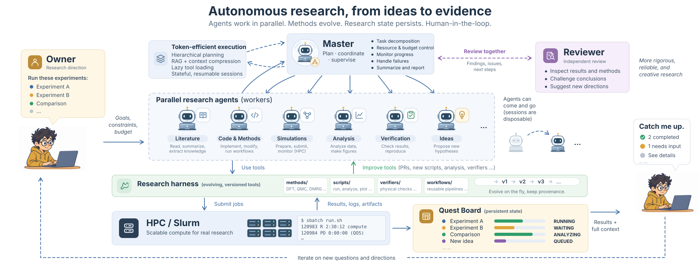
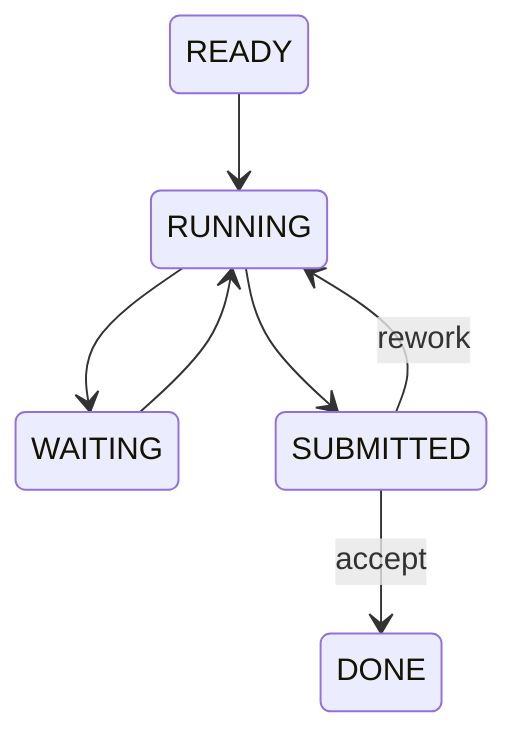

# agent-farm-runtime

You start a set of experiments and step away. By the time you return, some jobs have
finished, one needs a code fix, and an agent session has ended. Before the research
can move forward, someone has to reconstruct what ran, which outputs passed their
checks, and what still needs your decision.

agent-farm-runtime exists to make that handoff reliable. You discuss the research
with a Master agent in natural language. The Master sets up and supervises the farm,
workers execute the approved plan, and a Quest Board keeps progress and evidence
visible. When results are ready, you discuss them with an independent Reviewer and
tell the Master what to do next.

<p align="center">
  
</p>

The Quest Board is rendered by `farmboard` from task records and workspace evidence.
The research harness lives in a separate project repository and supplies the methods,
scripts and scientific checks used by the Master and Workers. Dashed links show
execution through `farmkit` and inspection of evidence in the project workspace.

The Owner's interface is the conversation. The Master runs the commands for setup,
supervision and execution within the authority you give it; you do not need to type
`farm`, `farmkit` or `farmboard` commands. Reviewer feedback reaches you first and
does not automatically trigger another research round.

**Task state is durable; agents and sessions are disposable.**

The repository combines three Python packages: `agent_farm_runtime` for task
orchestration, `farmkit` for execution inside a task, and `farmboard` for inspection.
It is designed for a single-owner research farm on Linux, with local commands or
Slurm jobs and optional Codex or Claude Code workers in tmux.

## How a farm works

| Role | Responsibility |
|---|---|
| Owner | Develops the research direction and delegates authority in conversation; optionally sets resource limits, discusses independent review and authorizes the next step. |
| Master agent | Sets up and operates the farm under that authority, turns the plan into task contracts, monitors progress, handles permitted code fixes, and records the owner's decisions. |
| Reconciler daemon | Dispatches workers, applies lease-bound receipts, observes waiting conditions, and resumes eligible tasks. |
| Worker | Runs `farmkit tick`, reads its summary, executes the receipt command it prints, and exits until the next wake. |
| Independent reviewer | Reads deliverables and evidence and discusses them with the owner. Review advice does not automatically change task state. |

These are workflow roles, not access-control identities. Both the runtime CLI and
the reconciler perform supported writes to `.farm/`; agents do not edit those files
by hand. Scientific code and project-specific checks live in the task workspace.

The usual lifecycle is:



`WAITING` names a condition such as `job:<id>`, `task:<id>`, `artifact:<path>`, or
`ruling:<name>`. `SUBMITTED` means ready for acceptance; `task-accept` records the
decision and moves it to `DONE`. Nonterminal tasks can also be blocked or fail;
`DONE` and `FAILED` are terminal. See the [lifecycle contract](V2_DESIGN.md) for the
full state machine.

## Packages and boundaries

| Package | What it owns |
|---|---|
| `agent_farm_runtime` | Task store, leases, receipts, worker identity, executors, audit events, stop/restart and recovery. |
| `farmkit` | Step expansion, attempt ledger, code snapshots, submission intents, job observation, verification, failure evidence and bounded retries; master-side `watch` and `health`. |
| `farmboard` | A shared display model for text, static HTML and the optional Textual TUI. |

farmkit queries runtime state through the configured `farm` CLI. The board combines
those queries with workspace evidence. Its viewing operations are read-only;
interactive actions preview a CLI command and run it after confirmation. The board
does not maintain a second task database.

## Start through a Master conversation

Give a new Master the repository URL or checkout path and a short request:

> Read `templates/RUNTIME_MASTER.md` and set up a new farm for [project].
> Handle the setup yourself; we'll discuss the research once it is ready.

Setup does not require a research task or a numerical budget. The Master prepares
the farm and checks its operation; research goals and acceptance criteria develop
in the subsequent conversation. The normal resource policy is to use available
capacity within the authorized account/allocation and site limits for agreed work.
An Owner-specified resource ceiling is optional. The Master checks actual resource
constraints and asks only when an unresolved choice affects execution.

The [Master entrypoint](templates/RUNTIME_MASTER.md) covers initial setup and
returning to an existing farm. The Master saves deployment details, operating
instructions and a checkpoint in its own persistent working directory outside
this repository. For Claude Code, it creates a local `CLAUDE.md` entrypoint there.
Start subsequent Master sessions in that directory and say "catch up"; the Master
reads the saved instructions and checks current runtime evidence before reporting.
Other agent hosts should load the same saved `MASTER.md` explicitly.

The Owner supplies research decisions and authority as needed; deployment commands
and the full operating procedure do not need to be pasted into each conversation.

## Install and inspect a task

The following sections are command references for the Master and contributors.
As an Owner, you can instead ask: "Set up a farm for this project; we'll discuss
the research once it is ready." The task examples below apply after a task is agreed.

From a checkout of the chosen revision, the Master prepares the environment:

```bash
python3 -m venv .venv
source .venv/bin/activate
python -m pip install .

farm --project ./demo-farm init
farm --project ./demo-farm task-create --id T-1 \
  --objective "Evaluate a research method against a fixed baseline" \
  --deliverable "A reproducible result and comparison report" \
  --acceptance "Declared checks pass and the result is reviewed"
farm --project ./demo-farm status
farm --project ./demo-farm task-show T-1 --summary
farm --project ./demo-farm doctor
```

This creates and inspects a task contract. It does not start an agent or submit a
job. Runtime and farmkit require Python 3.11+ and use the standard library.
The execution backend requires Linux and POSIX filesystem operations; tmux workers
also need tmux, bash 4.4+, and the chosen agent CLI configured on the worker host.
Slurm steps require scheduler access. See [portability](docs/PORTABILITY.md).

For the interactive board, install the optional dependency from the same revision:

```bash
python -m pip install ".[board]"
```

## Prepare a research workspace

Start with [five_arm_study](examples/five_arm_study/README.md). It includes:

- `BRIEF.md`: goal, boundaries, selected reading and the worker's method.
- `steps.toml`: commands, dependencies, input/output paths, matrix arms, chains,
  snapshot patterns and retry budgets.
- Scientific scripts and an optional `verifiers.py` module for project checks.

Validate the supplied example without launching computation:

```bash
farmkit brief lint examples/five_arm_study/BRIEF.md
farmkit steps check --workspace examples/five_arm_study --verifiers verifiers
```

When a step declares `verify`, pass the module that supplies that function to both
`steps check` and `tick`. The first declared output is the main JSON artifact and
must record the actual attempt ID, for example from Python:

```python
import os

{"provenance": {"attempt_id": os.environ["FARMKIT_ATTEMPT_ID"]}}
```

Each worker wake follows the [execution guide](skills/farm-execution.md):

```bash
farmkit tick --workspace /absolute/path/to/workspace --checkpoint --verifiers verifiers
# Read the summary, run the exact receipt command it prints, then exit.
```

tick snapshots declared code, records intent before `sbatch`, checks completed
attempts, and starts steps whose dependencies are satisfied. It prints the receipt
command; it does not execute that command or write runtime task state itself.
Generic checks establish attempt identity, required outputs and finite metrics.
Project verifiers can add scientific checks; final acceptance remains a recorded
decision by an authorized person or agent.

## Configure and start a deployment

Use a fixed release for a running farm. Copy [sites/example.toml](sites/example.toml)
to your own configuration directory and fill in interpreter paths, agent commands,
host matching and scheduler settings. Set `FARMKIT_SITE` to that file, or use its
hostname rule for automatic discovery. Ensure `farmkit`, the science environment
and scheduler commands are available in the worker's shell.

The following paths are examples to replace for your site. Create the farm directory
before rendering its startup script. Set `release_dir` to the exact directory printed
by `export`:

```bash
export FARMKIT_SITE="$HOME/.config/agent-farm/sites/mycluster.toml"
farm_project="/shared/farms/F1"
farm_wrapper="/shared/farms/bin/farm"
mkdir -p "$farm_project"

python tools/release.py export --src src --tag 0.4.0 --releases-root /shared/releases
release_dir="/shared/releases/agent-farm-0.4.0-REPLACE_WITH_DIGEST"
python tools/release.py wrapper --site "$FARMKIT_SITE" \
  --release "$release_dir" --out /shared/farms/bin --farm "$farm_project"

"$farm_wrapper" --project "$farm_project" init
"$farm_wrapper" --project "$farm_project" task-create --id T-1 \
  --objective "Your research objective" --deliverable "Your deliverable" \
  --acceptance "Your acceptance criteria" \
  --workspace /absolute/path/to/workspace \
  --brief-file /absolute/path/to/workspace/BRIEF.md --executor codex-tmux
```

Use this explicit wrapper for farm commands, and configure `paths.farm_wrapper` in
the site profile for watch/health/board. Install farmkit and farmboard from the same
chosen revision; exporting a release does not install their CLI entry points.
Review the agent command's permissions in your site profile: headless workers may
run without interactive approval, and the runtime does not sandbox scientific code.

On the designated farm host, the Master starts the loop as part of the owner's
authorized setup or restart request:

```bash
FARM_ACTUATION_ALLOWED=1 "$farm_project/run_reconciler.sh"
```

The Master keeps the loop in its dedicated session and uses a separate shell for
inspection and decisions. The generated wrapper defaults to actuation off; the
startup script alone does not enable it. `FARM_ACTUATION_ALLOWED=1` is supplied by
the Master under the owner's authorization, not something the owner must type.

For Slurm node turnover, the Master can publish its separate human-facing tmux
endpoint under a farm-specific target such as `cluster/study-a`. Each target is
permanently bound to one farm/root; other farms use different targets. The access layer keeps
immutable records on shared storage and requires exact deployment, epoch, job
and tmux identity checks. `access resolve` returns a candidate; `access verify`
on the recorded host returns attachment arguments only when all checks pass.
See the [access protocol and runbook](docs/ACCESS_PROTOCOL.md). A local connection
client and terminal UI are separate work; these commands do not attach or start
sessions.
The deployment records the runtime hostname and exact Slurm node separately,
using launcher identity captured at reconciler startup. A movable local shorthand
belongs to the future connection client, not the remote registry.

## Inspect, review and continue

In that separate shell, the Master activates the same environment and sets
`farm_project` and `farm_wrapper` to the deployment paths used above.

```bash
farmboard --project "$farm_project" --farm-wrapper "$farm_wrapper" --once
# Omit --once for the Textual TUI, or use --html board.html for a static page.
farmkit watch --project "$farm_project" --farm-wrapper "$farm_wrapper"
```

watch returns when a task is submitted, needs a ruling, or the daemon needs attention.
After handling a notification, run `farmkit watch --project "$farm_project" --ack
CURSOR` in the same master working directory, using the printed cursor. watch only
returns a notification; continued model activity requires an agent host that can
notify the master about background command completion. It does not start a master
session itself.

Review a SUBMITTED task using [REVIEW.md](templates/REVIEW.md), then record acceptance
or rework with the task's current revision and an evidence file. Read the full
contract and results before accepting. An independent reviewer can report to the
owner, who then directs the master to record the decision.

There are two distinct actions after a parked step: `farm task-ruling` records the
instruction and permits the worker to wake; the worker follows that instruction
with `farmkit release --step STEP --ruling 'decision and reason'` before ticking
again. Waking the worker alone does not release its parked attempt.

By default, an infrastructure failure gets one automatic retry. Code failures park
for the master; science, budget, exhausted infrastructure retries and owner holds
require the owner's decision under the supplied workflow. The task's explicit
retry settings determine the execution budget.

For command examples covering acceptance, rework, drain/stop, upgrade and context
rotation, see [operations](docs/OPERATIONS.md). `restart --to` validates the target,
stops the daemon and prints the startup command for the new wrapper; it does not
start the replacement daemon. Do not edit source underneath a running deployment.

## Persistence and recovery

```text
<farm>/.farm/
  tasks/                 authoritative task records
  workers/               observed worker records
  events/                append-only audit history
  runtime/               deployment, locks, receipts and last tick

<workspace>/
  BRIEF.md, steps.toml    task instructions and step definitions
  CHECKPOINT.md          mechanical progress plus the agent's judgment
  REVIEW.md              review evidence, when prepared
  attempts/<id>.json     execution record
  attempts/<id>/code/    code snapshot and execution directory
  attempts/<id>/FAILURE.md
```

The runtime persists ownership before dispatch and rejects stale receipts. Unknown
process or scheduler state is not treated as proof of death or completion. Submission
intents let a later tick reconcile an uncertain job ID without blindly submitting again.

Only code matched by `snapshot` is frozen. Inputs may be links to mutable files;
projects must specify their input versions and environment. Declared outputs are
written in the attempt directory and published after verification. In an `afterok`
chain, use relative run-directory paths to consume the producer attempt; the
workspace copy may still be the previous verified result.

## Validation and current limits

Package version: **0.4.0**. Runtime protocol: **4**.

- The local regression run at `e6c1ebd` reported **406 passed, 2 skipped**. The suite
  includes unit tests, fault replays and integration tests with a fake scheduler.
- [LESSONS.md](docs/LESSONS.md) records real-Slurm scratch canaries using a
  **local-process worker**, including wait/resume, submission, acceptance, drain
  and release restart. Those runs do not establish equivalent coverage for every
  real Codex or Claude session path.
- The interactive Textual UI has not yet been validated in a real terminal.
- Control access has isolated unit/fault coverage; real Slurm/tmux and cross-node
  storage validation remain the [access canary gate](docs/ACCESS_PROTOCOL.md#deployment-and-canary-gate).
- The protocol package re-exports definitions from other modules; hashing that
  directory alone does not prove format compatibility. The release source digest
  currently covers the runtime package, not the complete three-package bundle.
- Shared filesystem behavior and execution environments need site validation.
  See [compatibility](docs/COMPATIBILITY.md) and [portability](docs/PORTABILITY.md).

Run the test suite from a development checkout:

```bash
python -m pip install -e ".[dev]"
python -m pytest -q
```

The optional private-tmux canary uses a stub agent; the normal suite makes no model
calls. See [contributing](CONTRIBUTING.md) for implementation rules and
[lessons](docs/LESSONS.md) for the failures behind the regression tests.

## Documentation

- [Operations](docs/OPERATIONS.md): current commands and procedures for the Master.
- [Control access](docs/ACCESS_PROTOCOL.md): schema, CLI, bootstrap, turnover and client contract.
- [Master entrypoint](templates/RUNTIME_MASTER.md): the natural-language delegation workflow.
- [Design contract](V2_DESIGN.md): retained invariants and the historical runtime baseline.
- [Lessons](docs/LESSONS.md): failure mechanisms and the regression tests that preserve their fixes.

The design and lessons files are maintainer references; the Owner does not need to
read them to use a farm.

## License

A license has not yet been selected; this repository does not include a LICENSE file.
