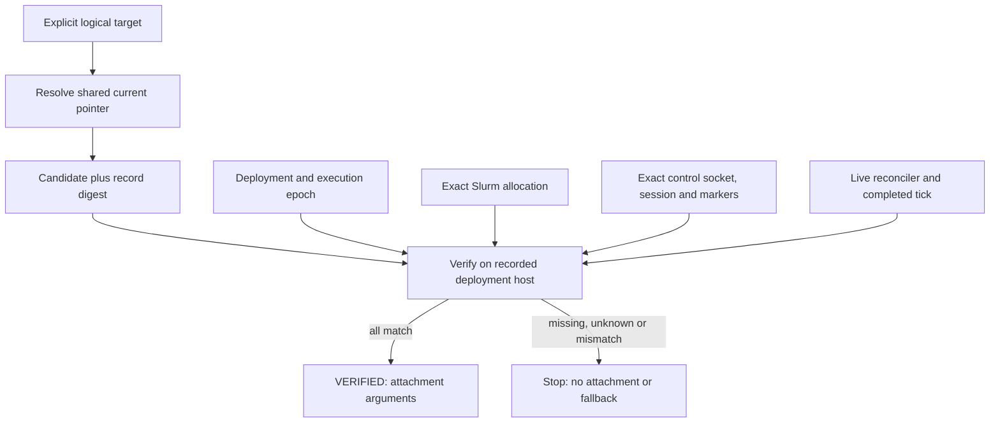

# Control-session access protocol

The access layer maps an explicit logical target such as `delta/primary` or
`rc/primary` to a verified, human-facing Master tmux session. Nodes, allocations
and sessions can change across execution epochs without changing that target.
The Master operates this layer under the Owner's deployment authority. It uses
the CLI; it never edits access JSON, deployment JSON or tmux identity markers.

**Deployment `session` and `tmux_socket` still describe the worker executor.**
Access never reads them to choose a control endpoint. Publication requires an
explicit control session and a separately selected control socket. It does not
start the Master, create a session, connect SSH, attach a terminal, submit a job,
cancel a job, or change a task. The independent Reviewer remains outside this
control loop.

## Authority and state



The deployment manifest remains the execution authority. The registry publishes
an endpoint for that deployment, not another scheduler or ownership database.
Readers follow **only** `current.json`. They never enumerate epochs, job names,
farms or sessions to find a replacement. Publication time is not a ranking rule.

Publication requires all of the following:

- An explicitly configured, owner-controlled persistent shared registry and farm
  root. Both must survive node loss at the same canonical absolute paths.
- A valid access-capable deployment manifest, no pending deployment audit,
  recovery or task transaction, and an absent handoff or a matching `claimed`
  handoff. `draining`, `released` and stop controls withhold publication.
- The executing host, imported runtime source SHA-256 and runtime protocol match
  deployment. A supplied `--expected-epoch` must match too.
- A live loop daemon with exact host/boot/process-namespace/PID/start identity;
  a completed tick stamped with that daemon's startup identity and execution
  epoch; and a tick between startup and now, no older than three loop intervals.
  A claim alone, a one-pass reconcile, or an old daemon's tick is insufficient.
- The exact numeric Slurm allocation is positively `RUNNING`, belongs to the
  publishing UID and includes the exact deployment hostname in its NodeList.
  Slurm's allocation StartTime is retained to detect job ID reuse.
- The exact Unix socket exists and belongs to that UID, the exact session exists,
  and the optional window exists uniquely. The socket device/inode, server
  PID/start/boot identity, native session ID and optional window ID are bound.
- Session environment markers agree with the record. Publish fills missing
  markers, but refuses conflicting ones. Verify only reads them.

The markers are `FARM_ID`, `FARM_EXECUTION_EPOCH`, `FARM_SLURM_JOB_ID`, `FARM_ROOT`,
`FARM_ACCESS_TARGET`, `FARM_SOURCE_SHA256` and `FARM_PROTOCOL_VERSION`.
They are **session** environment values, not inferred pane environment or global
tmux state. Unrelated environment values are not returned or persisted.

`farm_id` is `farm-` followed by SHA-256 of the UTF-8 canonical `.farm` root path.
This gives the existing path-bound farm an identity that survives host turnover.
It is not a credential or a claim of global uniqueness across unrelated storage
systems. Relocation, cloning a farm, reusing its directory for a different farm,
or reassigning a target is not supported by this access schema.

## CLI

Use the deployment's pinned `farm` wrapper. Configure the registry explicitly
with `--registry /shared/farm-access`, or set `FARM_ACCESS_REGISTRY` to that path.
There is no default registry discovery and no built-in site aliases.

```bash
farm access init --registry /shared/farm-access --attest-shared-storage

farm --project /shared/farms/F1 access publish \
  --registry /shared/farm-access --target delta/primary \
  --job-id "$SLURM_JOB_ID" --control-session master \
  --control-socket /run/user/1001/farm-master.sock \
  --default-window main --expected-epoch node-002 --json

farm access resolve \
  --registry /shared/farm-access --target delta/primary --json

farm --project /shared/farms/F1 access verify \
  --registry /shared/farm-access --target delta/primary \
  --expected-record RECORD_SHA256_FROM_RESOLVE --json
```

`init` requires an already provisioned parent directory and the storage
attestation. The Master must first establish that both registry and farm storage
are shared, persistent and support the durability operations below. The code
rejects known volatile registry/farm paths (`/tmp`, `/var/tmp`, `/dev/shm`, `/run`
and their macOS equivalents), including symlinks into them; a path outside those
locations alone does not prove persistence. A **control socket** may be on a
node-local volatile filesystem: its durable identity lives in the registry.

Targets are `NAME` or `SITE/NAME`. Each component, control session name and window
name uses `[A-Za-z0-9][A-Za-z0-9_-]{0,63}`. Numeric window arguments select an exact
window index; other arguments select an exact name and reject duplicate names.
Epochs use the existing `[A-Za-z0-9][A-Za-z0-9_.-]{0,127}` convention. Slurm job IDs
are positive decimal allocation IDs; job arrays, steps and federation routing
are not part of schema 1.

`--control-socket` is an absolute `tmux -S` path, **not** a `-L` socket name.
When omitted it means `$TMUX_TMPDIR/tmux-UID/default`, or
`/tmp/tmux-UID/default` if `TMUX_TMPDIR` is unset. The inherited `TMUX` variable
is ignored. Explicit socket paths are preferable in deployment scripts.
`--default-window` and `--expected-epoch` are optional. Without a window, access
binds the session and leaves window selection to tmux.

All four commands output JSON; `--json` is accepted for explicit client intent.
Exit code 0 means `INITIALIZED`, `RESOLVED` or `VERIFIED`; protocol failures
return 1. Invalid CLI syntax and wrapper policy failures retain the existing CLI
exit behavior. Clients must require valid schema 1 JSON, `state == "VERIFIED"`
**and** `verified == true` before using attachment data; exit code 0 alone is
insufficient.

## Durable schema 1

For target `delta/primary`:

```text
/shared/farm-access/
  registry.json
  registry.lock
  targets/delta/primary/
    publish.lock
    binding.json
    epochs/initial.json
    epochs/node-002.json
    current.json
```

`registry.json` is exactly:

```json
{"schema_version": 1, "storage": "persistent-shared", "owner_uid": 1001}
```

`binding.json` is exactly `schema_version`, `target`, `farm_id`, `farm_root`, with
values copied from the first record. It permanently binds the target to one farm,
including when the first publication crashes before creating a current pointer.

An immutable `epochs/node-002.json` has exactly these fields (identity numbers and
digest placeholders below are illustrative):

```json
{
  "schema_version": 1,
  "target": "delta/primary",
  "farm_id": "farm-<sha256-of-canonical-farm-root>",
  "farm_root": "/shared/farms/F1/.farm",
  "execution_epoch": "node-002",
  "runtime_host": "node-b.example",
  "protocol_version": 4,
  "source_sha256": "<64-lowercase-hex-digits>",
  "owner_uid": 1001,
  "scheduler": {
    "kind": "slurm",
    "job_id": "12345",
    "allocation_started_at": "2026-01-01T12:00:00"
  },
  "control": {
    "socket": "/run/user/1001/farm-master.sock",
    "socket_device": 25,
    "socket_inode": 1234,
    "session": "master",
    "session_id": "$1",
    "default_window": "main",
    "window_id": "@1",
    "server_pid": 123,
    "server_starttime": 456,
    "boot_id": "<linux-boot-id>"
  },
  "published_at": "2026-01-01T12:01:00+00:00"
}
```

`default_window` and `window_id` must both be null if no window is specified.
`allocation_started_at` preserves Slurm's StartTime string; `published_at` is a
timezone-bearing ISO timestamp. Integer fields do not accept booleans.
Unknown fields/versions, duplicate JSON keys, non-finite values, oversized files,
invalid identifiers and symlink records are rejected.

`current.json` is exactly:

```json
{
  "schema_version": 1,
  "target": "delta/primary",
  "execution_epoch": "node-002",
  "record_sha256": "<64-lowercase-hex-digits>"
}
```

`record_sha256` is SHA-256 of the UTF-8 result of Python
`json.dumps(record, sort_keys=True, separators=(",", ":"), allow_nan=False)`
(including the default ASCII escaping). It covers the entire immutable record,
including publication time. The pointer supplies an epoch, not an arbitrary
filesystem path. Readers validate the record, digest, binding and deployment.

Every response contains `schema_version`, `state`, `target`, `verified`, `reason`,
`detail`, and `observed_at` (timezone-bearing ISO). Success responses add:

- `INITIALIZED`: no endpoint fields; `target` is null.
- `RESOLVED`: `record`, `record_sha256` and `verification` containing `host`,
  `project`, `registry`, `target`, `expected_record`. No attachment is authorized.
- `VERIFIED`: `record`, `record_sha256`, and `attachment` containing `host` and
  an argv array, for example
  `["tmux", "-N", "-S", "/run/user/1001/farm-master.sock", "attach-session", "-t", "$1:@1"]`.
  The command is returned, never executed by this layer.

The response state vocabulary is:

| State | Meaning and operator action |
| --- | --- |
| VERIFIED | All current observations match; point-in-time attachment contract. |
| RESOLVED | Shared records match; host verification still required. |
| INITIALIZED | Registry prepared; no target published by this action. |
| UNPUBLISHED | Registry/target/current absent or registry unconfigured; no archive search. |
| AUTH_REQUIRED | Storage, socket, allocation owner or observation permission mismatch; correct access externally. |
| PENDING | Audit/transaction, drain/release, allocation or reconciler readiness prevents access. |
| JOB_EXPIRED | Positive terminal state for the exact recorded job; does not authorize replacement. |
| STALE_REGISTRY | Source/protocol, pointer digest, allocation start or native control identity changed. |
| HOST_MISMATCH | Deployment, local verifier or exact allocation host disagrees. |
| EPOCH_MISMATCH | Current record or explicit epoch precondition differs from deployment. |
| SESSION_MISSING | Exact socket/session/window is positively absent; no alternative selected. |
| CONFLICT | Invalid schema, incompatible binding, markers or same-epoch publication. Preserve evidence. |
| UNREACHABLE | Observation, process identity or storage cannot establish the required facts. Retry observation only. |

Failure responses contain no record to attach to and no attachment arguments.
A purged Slurm job producing an error is `UNREACHABLE`, not inferred dead from
absence. SSH authentication and network failures before the CLI runs must be
reported by the later client, never translated into replacement permission.

## Publication transaction and crash behavior

Publication first checks the configured registry and deployment. It then takes
the target's `publish.lock`, followed by the farm's existing task mutation lock.
Startup, drain and claim cooperate with the same farm lock. Acquisition has the
existing bounded retry; no locks are deleted or replaced to escape contention.
Publication may delay task writes while its bounded observation commands run.

Under those locks it checks readiness, the exact allocation and endpoint; rejects
an incompatible existing binding or epoch; fills absent session markers; and
verifies everything. It writes the immutable binding and epoch record using
file fsync, atomic rename and directory fsync. It re-verifies after the durable
write, then atomically replaces and synchronizes `current.json`.

An identical retry retains the original `published_at` and immutable file. Any
other difference for that epoch is a conflict. A broken current pointer is never
silently repaired by publish or a reader. Retry is allowed to finish its own
incomplete publication; it is not allowed to invent a new endpoint for it.

| Interruption | Durable outcome |
| --- | --- |
| Before an epoch write | No new current; some matching markers or a target binding may exist. |
| After epoch write, before pointer replacement | Orphan epoch retained; old pointer or UNPUBLISHED remains. |
| After pointer rename, before final fsync/response | Outcome uncertain to caller; resolve/verify, then retry identical publication if needed. |
| Two identical publishers | Serialized; one immutable record, identical successful retries. |
| Two different endpoints for one epoch | First durable record wins; conflicting publication fails. |
| New allocation is queued or merely RUNNING | Pointer unchanged until claim, live completed tick, control creation and verified publication. |

After claim the old pointer may still exist, but its epoch disagrees with the
deployment and readers refuse it. Old records and even old live sessions are
retained as evidence, never selected as fallback.

Verification takes no locks and performs no writes. It checks the control
identity again after reading markers, and rereads deployment and current before
returning. These are point-in-time checks, not a distributed fencing token. A
node or tmux server can disappear after verification. The client must verify
immediately before attachment, use the returned native IDs, stop on any attach
error and begin again with resolve; it must never try an old host or session.
Same-UID manual edits and external session manipulation are outside cooperative
locking. This is not protection against a malicious account sharing that UID.

## Master runbook

### Initial bootstrap

1. Provision a disposable or approved farm, the pinned release/wrapper and shared
   storage using [deployment setup](../README.md#configure-and-start-a-deployment).
   Verify common canonical paths, consistent UID, cross-node flock, file/directory
   fsync and rename semantics. Provision the registry parent, then run
   `farm access init --registry /shared/farm-access --attest-shared-storage`.
   Do not place the registry or `.farm` on node-local scratch.
2. Through the separate site workflow, obtain the authorized Slurm allocation.
   On its exact deployment host, start the reconciler loop with the pinned
   wrapper. Wait for a completed, fresh tick in `farm --project PROJECT status
   --json`. For an existing deployment, first use the reviewed stopped-writer
   upgrade procedure; do not patch identity fields into an old manifest.
3. Through the normal Master launch procedure, create the human-facing tmux
   session on an explicitly chosen socket and start/resume the Master there.
   For example, `tmux -S /run/user/1001/farm-master.sock new-session -s master -n
   main` creates that control session; substitute the site's owned socket path.
   This action is external to access publication. Do not assume the executor's
   worker session is the Master.
4. Run `access publish` as above with the actual allocation ID, socket, exact
   session and optional window. For a new farm the existing epoch is `initial`;
   use that value for `--expected-epoch`. Require `VERIFIED`. If publication
   fails, follow its state/reason and retry only after the actual prerequisite
   is satisfied. Never edit a registry file or markers to make it pass.
5. Run `access resolve` from a host that can read the shared paths, then run
   `access verify --expected-record DIGEST` on its recorded host using the same
   pinned runtime. Archive both JSON outputs as deployment evidence.

### Planned node turnover

1. Arrange the destination allocation and exact node using the existing site
   workflow, allowing overlap. Keep the old allocation through sealed release.
   A queued request does not select a destination or change current access.
2. On the old node, run `farm --project PROJECT handoff drain --request-id
   node-002 --target-host EXACT_DESTINATION_HOST --actor master`, complete the
   existing checkpoint/exit checks, then `handoff release --request-id node-002
   --actor master`. See the full [handoff procedure](OPERATIONS.md#planned-context-and-node-turnover).
   Access now reports PENDING; it does not redirect around drain.
3. On the destination, run `farm --project PROJECT handoff claim --request-id
   node-002 --actor master`. Use the same source, runtime protocol and executor
   settings. Start the reconciler loop and wait for its own completed tick.
4. Create the destination's separate control session and start/resume the Master
   with its checkpoint. Run `access publish` for the **same logical target**,
   new allocation and explicit control endpoint, with `--expected-epoch node-002`.
   Only successful verification publishes the new current pointer. Verify the
   resolved digest from the destination before treating access as ready.
5. Keep old epoch files. If the old node vanished before release, access cannot
   authorize claim, recovery, cancellation or a replacement. Follow the existing
   [offline recovery](OPERATIONS.md#offline-hostprotocol-recovery) procedure with
   positive shutdown evidence; publish only after the recovered epoch is ready.

Master conversation rotation can reuse an existing bound tmux session/window.
Destroying/recreating the server, socket, bound session or selected window makes
its immutable epoch record stale. There is deliberately no `--force`, `unpublish`
or same-epoch overwrite. Restoring markers via verify is also forbidden. A new
endpoint requires an independently authorized execution-epoch transition through
the existing turnover/recovery procedures; those procedures must satisfy their
own preconditions. Do not invent a handoff or delete records to bypass this rule.

## Compatibility and client boundary

This is **access schema 1**, an additive deployment contract; runtime protocol
stays **4**. No task, receipt, lease, executor state or turnover control format is
changed. Startup adds `farm_id`, `farm_root` and an explicit `execution_epoch`;
heartbeat adds a `deployment` identity stamp. Existing status/board readers can
ignore them. An old manifest or tick cannot be used for access publication until
a reviewed upgraded reconciler has started and completed a pass. Old binaries
cannot provide this access CLI or readiness contract. They are not supported
participants in an access-enabled deployment.

Use one fixed reviewed release for the daemon, publisher and verifier. A source
upgrade after publication makes the record stale. Since records bind both build
and epoch, republishing a different source in the same epoch is a conflict;
plan a supported epoch transition as well as the reviewed build upgrade before
re-enabling access. `farm restart --to` alone does not create an access generation.
Do not change build during a planned handoff.

Linux process identity, POSIX durable storage, Slurm `scontrol` and tmux are
required for publication/verification. Resolution only reads shared records and
does not import a POSIX write backend or execute remote commands. Exact hostnames
must agree between deployment and the expanded Slurm NodeList; short-name/FQDN
guessing is intentionally absent. Slurm and tmux calls use argv arrays, a
10-second subprocess timeout and no shell. The probe uses `scontrol --local
--oneliner show job JOBID`, expands only that job's NodeList, and uses `tmux -N
-S SOCKET` with exact targets. See the official [Slurm scontrol reference](https://slurm.schedmd.com/scontrol.html)
and [tmux reference](https://man.openbsd.org/tmux.1).

A later `farm-connect` client can map a local word such as `delta` to a configured
resolver transport, registry and `delta/primary`. It runs resolve where the shared
farm paths are mounted, carries `expected_record` to verify on the exact host,
then handles authentication and the returned attachment argv. No local Mac mount
is required if resolution runs remotely. SSH aliases, credentials, ControlMaster,
Ghostty, routing and tmux UI preferences belong to that client/site configuration.
This repository provides neither that client nor unattended reconnection.

## Deployment and canary gate

No real scheduler/session or site deployment is required by the unit suite.
Access fault tests use synthetic deployment/Slurm/tmux observations and temporary
Unix socket fixtures. They test concurrent publication, crash boundaries,
immutable retry, drain serialization, stale/unknown observations and read-only
behavior. They do not establish a site's filesystem or hostname behavior.

Local validation for this change on Linux, Python 3.11.4: **500 passed, 3 skipped**
in 238.05 seconds. The skipped tests require an explicitly supplied private
release wrapper, an offline recovery fixture, or the opt-in private tmux canary.
No real Slurm/tmux canary, CI matrix run or site deployment was performed.
The full regression command was:

```bash
env -u FARM_RUN_TMUX_CANARY -u FARM_TEST_REFERENCE_WRAPPER \
  PYTHONPATH=src PYTHONDONTWRITEBYTECODE=1 \
  python -m pytest -q -p no:cacheprovider
```

Before production adoption, with separate authorization:

1. Export the reviewed commit, retain the prior wrapper/release and create an
   isolated shared registry and empty canary farm. Do not reuse a production
   target. Check the storage and exact Slurm/tmux command contracts on the site.
2. On an explicitly provisioned allocation, start an empty reconciler and a
   disposable control session. Publish/resolve/verify; try a wrong session,
   socket and window, an incorrect job ID, a simulated observation timeout, and
   concurrent identical/conflicting publishes. Every refusal must omit attach.
3. With two authorized overlapping allocations, complete normal drain, release,
   claim and readiness. Confirm the old pointer persists until verified publish,
   remains unusable after claim, and both immutable epoch files remain afterward.
   Repeat a crash after the instance write in the disposable registry, then retry
   the identical publication. Check visibility and lock exclusion from both nodes.
4. Preserve JSON outputs and task/event snapshots, verify that reads changed no
   task state, and review the evidence before enabling a production target or a
   Mac client. No test should kill, submit or cancel an unrelated allocation.

If the canary fails, stop access adoption and retain its records. Removing a
client's use of the target is sufficient to stop reconnection attempts; access
owns no background service. Runtime rollback follows the existing stopped-writer
procedure and does not rewrite access history. Do not automatically repoint an
existing target to an older generation.
